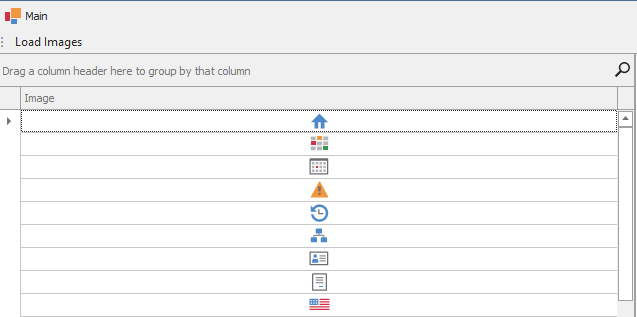
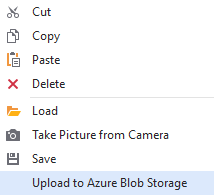
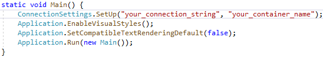

# How to load and upload images from/to Azure Blob Storage 

This example illustrates how to load SVG images from [Azure Blob Storage](https://azure.microsoft.com/en-us/services/storage/blobs/) and upload local images there back.

To get started, you need to install the [Azure.Storage.Blobs](https://www.nuget.org/packages/Azure.Storage.Blobs) NuGet package and follow the steps from the [Quickstart: Azure Blob storage client library v12 for .NET](https://docs.microsoft.com/en-us/azure/storage/blobs/storage-quickstart-blobs-dotnet#download-blobs) Microsoft topic.

We fetch images asynchronously and add them to  [GridControl](https://docs.devexpress.com/WindowsForms/DevExpress.XtraGrid.GridControl) by using [UnboundSource](https://docs.devexpress.com/CoreLibraries/DevExpress.Data.UnboundSource) that allows you to dynamically add columns and rows.

By extending a context menu of [PictureEdit](https://docs.devexpress.com/WindowsForms/DevExpress.XtraEditors.PictureEdit), we also illustrate how to upload the editor current image to **Azure Blob Storage**.

To run this example, it is also necessary to specify your connection settings in the **Main** method:

